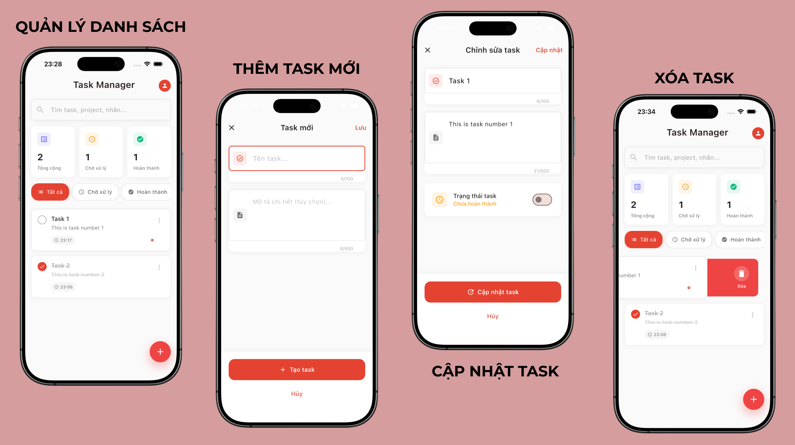

# 🧩 Task Manager Demo

Ứng dụng Flutter CRUD đơn giản giúp quản lý công việc cá nhân (Task Management App).  
Dự án được xây dựng nhằm mục đích **demo xin thực tập Flutter Developer**, tập trung vào cấu trúc rõ ràng và thao tác với **SQLite**.

---

## 🚀 Tính năng chính

- Thêm công việc mới
- Chỉnh sửa thông tin công việc
- Xóa công việc
- Đánh dấu hoàn thành/chưa hoàn thành
- Lưu trữ dữ liệu **cục bộ bằng SQLite**
- Giao diện tối giản, dễ sử dụng

---

## 🛠️ Công nghệ sử dụng

- **Flutter SDK:** 3.x
- **Ngôn ngữ:** Dart
- **Database:** SQLite (thông qua `sqflite` package)
- **State Management:** Provider
- **IDE:** VSCode

---

## 📂 Cấu trúc thư mục

```plaintext
lib/
 ├── main.dart                              # File khởi động ứng dụng
 ├── database/
 │    └── database_helper.dart              # Quản lý kết nối & CRUD SQLite
 ├── models/
 │    └── task.dart                         # Model dữ liệu công việc
 ├── providers/
 │    └── task_provider.dart                # Quản lý trạng thái toàn cục
 ├── screens/
 │    ├── task_list_screen.dart             # Màn hình danh sách công việc
 │    └── add_edit_task_screen.dart         # Màn hình thêm/chỉnh sửa công việc
 └── widgets/
      └── task_card.dart                    # Widget hiển thị từng công việc
```

---

## 🧑‍💻 Cách chạy dự án

```bash
# Clone project
git clone https://github.com/dd-datt/task_manager_demo.git
cd task_manager_demo

# Cài đặt dependencies
flutter pub get

# Chạy ứng dụng
flutter run
```

---

## 🎯 Mục tiêu dự án

Dự án này được xây dựng nhằm:

- Tổng hợp và củng cố kiến thức nền tảng về Flutter.
- Thực hành phát triển ứng dụng CRUD sử dụng SQLite cho lưu trữ cục bộ.
- Nâng cao kỹ năng thiết kế giao diện, quản lý trạng thái và thao tác với cơ sở dữ liệu trong Flutter thông qua dự án thực tế.

---

## 🖼️ Ảnh minh họa



## 📧 Liên hệ

**Tác giả:** Đạt (@dd-datt)  
📩 **Email:** <vdat319@gmail.com>
